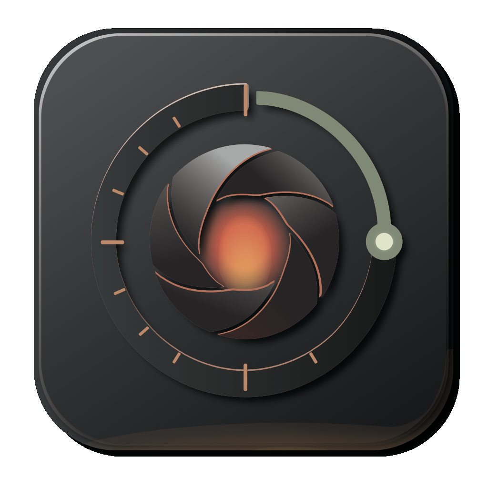
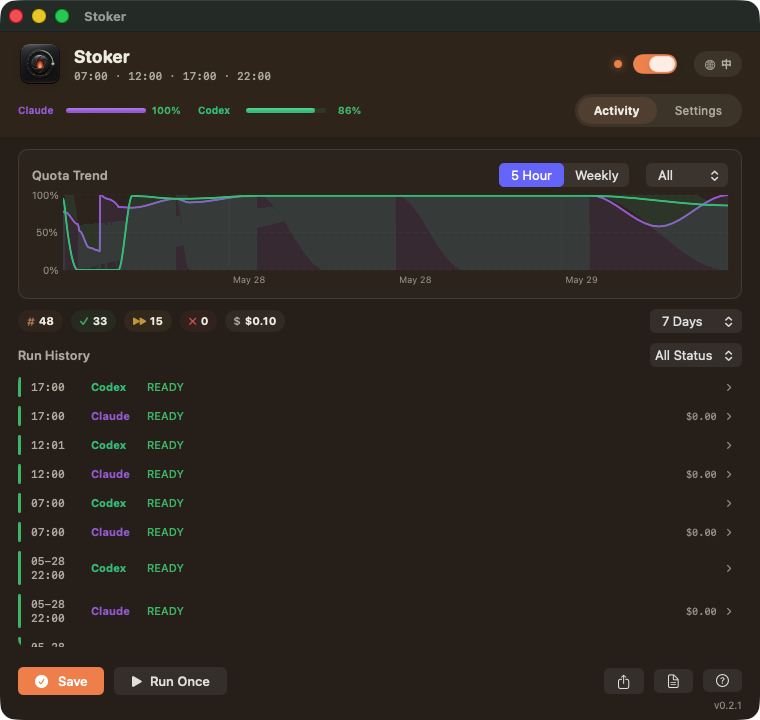
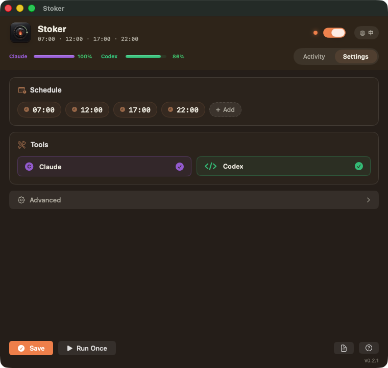
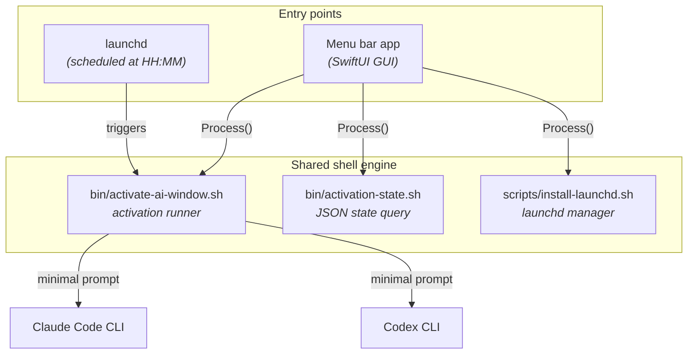

<div align="center">

[English](README.md) · [中文](README_CN.md)



# Stoker

**Keep your Claude Code & Codex usage windows lit — on a schedule you choose.**

A tiny macOS `launchd` scheduler that sends low-cost Claude Code and Codex check-ins at
fixed times, then records activation logs, per-run token usage, and quota status snapshots.

[](https://github.com/hakupao/stoker/actions/workflows/ci.yml)
[](LICENSE)
[](#requirements)
[](CHANGELOG.md)


[Features](#features) · [Quick Start](#quick-start) · [Menu Bar App](#menu-bar-app) · [How It Works](#how-it-works) · [Cost](#cost-optimization) · [Configuration](#configuration)

<br/>

<table>
  <tr>
    <td align="center"><sub><b>Activity · Light</b></sub><br/></td>
    <td align="center"><sub><b>Activity · Dark</b></sub><br/></td>
  </tr>
</table>

</div>

## About

Stoker is a small Bash-based utility for people who want predictable Claude Code and Codex
usage-window start times. It installs a macOS `launchd` agent that runs in a dedicated
lightweight folder, asks each CLI to reply `READY`, and keeps the prompt intentionally small
so it does not scan real projects or modify files.

The name is a nod to a *stoker* — the crew member who keeps a furnace fed so the fire never
goes out. That is exactly what this tool does for your AI usage windows: it keeps them lit on
a schedule you choose.

The default schedule is `07:00`, `12:00`, `17:00`, and `22:00` local macOS time.

## Features

| | Feature |
| :---: | :--- |
| ⏰ | **Scheduled activation** of Claude Code and Codex through macOS `launchd`. |
| 🪶 | **A minimal prompt** that tells both CLIs not to inspect files, run tools, or modify anything. |
| 📜 | **Human-readable run history** in `logs/activation.log`. |
| 📊 | **Structured per-run usage records** in `logs/usage.jsonl`. |
| 🔋 | **Five-hour and weekly quota snapshots** in `logs/status.jsonl`. |
| 🚦 | **Quota preflight** that skips activation gracefully when a known quota is exhausted. |
| 🧬 | **Clone-friendly configuration** through `.env`. |
| 🛟 | **Safe manual commands** for dry runs, dependency checks, quota checks, and uninstall. |

## Requirements

- macOS with `launchctl`.
- Bash.
- Claude Code CLI, authenticated with your Claude plan.
- Codex CLI, authenticated with ChatGPT.
- `jq` for structured JSONL parsing.
- Node.js for Codex quota status queries.
- `omc` / oh-my-claudecode for Claude quota status snapshots.

The activation itself only requires the Claude and Codex CLIs. Quota snapshots gracefully warn
and skip if optional helpers such as `omc`, `node`, or `jq` are missing.

## Quick Start

Choose one distribution:

- **CLI/launchd package**: for advanced users who want the lightest possible install and
  direct shell control.
- **Menu bar app package**: for beginners who want a GUI monitor and settings panel while
  keeping the same local scheduler underneath.

### CLI / launchd

```sh
git clone https://github.com/hakupao/stoker.git
cd stoker
cp .env.example .env
./install.sh check
./install.sh dry-run
./install.sh
```

`./install.sh` defaults to `install`, which generates a user LaunchAgent and loads it into the
current macOS GUI session.

### Menu bar app

Download the GUI DMG, drag `Stoker.app` to `Applications`, open it, then use the status-bar
menu to install/reload the schedule, refresh quota, run once, pause the schedule, and edit
settings. The app bundles the same CLI engine and installs its working copy under
`~/Library/Application Support/Stoker/stoker`.

See [INSTALL.md](INSTALL.md) for complete beginner and advanced installation steps.

## Commands

```sh
./install.sh check        # verify local dependencies
./install.sh dry-run      # show commands without sending model prompts
./install.sh quota        # query quota status without sending model prompts
./install.sh app-status   # print JSON status for the menu bar app
./install.sh status       # show launchd status
./install.sh run-now      # trigger once; this sends model prompts
./install.sh uninstall    # unload and remove the LaunchAgent
./install.sh print-plist  # print the generated launchd plist
```

You can also call the runner directly:

```sh
./bin/activate-ai-window.sh --once
./bin/activate-ai-window.sh --status
./bin/activate-ai-window.sh --once --tool claude
./bin/activate-ai-window.sh --once --tool codex
```

## Daily Operation

Use these checks to confirm the timer is installed, waiting, and recording results:

```sh
./install.sh status
tail -f logs/activation.log
tail -n 20 logs/usage.jsonl | jq
tail -n 20 logs/status.jsonl | jq
```

`./install.sh status` should show a loaded LaunchAgent with calendar triggers for your
configured hours. `state = not running` is normal between scheduled runs; it means the job is
loaded and waiting for the next trigger. During a trigger it may briefly show `running`.

`logs/activation.log` is the quickest human-readable view. A normal run looks like this:

```text
Activation run started ...
Quota preflight started
Claude job started
Codex job started
Activation run finished exit=0
```

If quota preflight decides not to send a prompt, the run stays clean and records a skip:

```text
claude job skipped by quota preflight reason=quota_exhausted
codex job skipped by quota preflight reason=quota_exhausted
```

`logs/usage.jsonl` is the structured success/skip record. Successful activations usually
include `ok: true`, `result: READY`, and `exit_code: 0`. Skipped activations include
`skipped: true` and a `skip_reason`.

Manual command guide:

- `./install.sh status`: checks whether local `launchd` has the timer loaded.
- `./install.sh quota`: checks quota status without sending prompts.
- `./install.sh dry-run`: prints the planned commands without sending prompts.
- `./install.sh run-now`: triggers the installed LaunchAgent once and may consume usage if
  quota is available.

## Configuration

Copy `.env.example` to `.env` and adjust values:

| Variable | Description | Default |
| --- | --- | --- |
| `LABEL` | macOS LaunchAgent label | `com.stoker.ai-window` |
| `SCHEDULE_TIMES` | Comma-separated `HH:MM` schedule entries; each time point is independent | `"07:00,12:00,17:00,22:00"` |
| `ACTIVATION_TOOL` | `all`, `claude`, or `codex` | `all` |
| `ACTIVATION_PROMPT` | Low-cost prompt sent to the CLIs | `Reply exactly READY...` |
| `CODEX_MODEL` | Codex activation model; set `default` to let Codex CLI choose | `gpt-5.4-mini` |
| `TIMEOUT_SECONDS` | Per-tool timeout | `120` |
| `ENABLE_STATUS_SNAPSHOTS` | Record quota snapshots after real activation | `1` |
| `ENABLE_QUOTA_PREFLIGHT` | Check quota before sending prompts | `1` |
| `QUOTA_PREFLIGHT_ON_UNKNOWN` | `allow` or `skip` when quota cannot be checked | `allow` |
| `QUOTA_EXHAUSTED_THRESHOLD_PERCENT` | Skip when remaining quota is at or below this percent | `0` |
| `KEEP_AWAKE_MODE` | `off`, `during`, or `always`; scheduled CLI runs use `caffeinate` when not `off` | `off` |
| `KEEP_AWAKE_SECONDS` | Bounded keep-awake duration for each real activation run | `900` |
| `CLAUDE_BIN` | Optional Claude binary override | auto-discovered |
| `CODEX_BIN` | Optional Codex binary override | auto-discovered |
| `JQ_BIN` | Optional `jq` binary override | auto-discovered |
| `NODE_BIN` | Optional Node.js binary override | auto-discovered |
| `OMC_BIN` | Optional `omc` binary override | auto-discovered |
| `PATH_VALUE` | PATH used by launchd and the runner | Homebrew/local/system defaults |

After changing schedule or label values, reinstall the LaunchAgent:

```sh
./install.sh install
```

## Logs

```sh
tail -f logs/activation.log
tail -20 logs/usage.jsonl | jq
tail -20 logs/status.jsonl | jq
```

Log files:

- `logs/activation.log`: human-readable run history.
- `logs/usage.jsonl`: one structured usage snapshot per tool per real run.
- `logs/status.jsonl`: five-hour and weekly quota snapshots per tool.
- `logs/raw/`: raw Claude/Codex/status outputs for debugging and future parsing.
- `logs/launchd.out.log` and `logs/launchd.err.log`: launchd stdout/stderr.

## Menu Bar App

The CLI/launchd workflow remains the primary engine. The optional menu bar app is a separate
beginner-friendly distribution that adds a macOS status-bar control surface for the same
configuration, schedule, quota snapshots, and logs. The interface follows the system Light/Dark
appearance and warms from a cool idle palette to a warm ember "active" state when the schedule
is on.

Highlights:

- **Activity dashboard** — per-tool quota-trend chart (5-hour / weekly), a run-history timeline
  with expandable per-run details (tokens, cost, duration, session), and summary stats with
  date-range / status / tool filters.
- **Settings** — edit independent schedule times, toggle Claude/Codex, and configure advanced
  options (quota preflight, post-run snapshots, keep-awake, launch at login).
- **Bilingual UI** with an EN / 中 switch; the appearance follows the system Light/Dark setting.
- **Environment Check** that detects required and optional CLI tools.
- **Export run history to CSV.**

<div align="center">
<table>
  <tr>
    <td align="center"><sub><b>Settings · Light</b></sub><br/></td>
    <td align="center"><sub><b>Settings · Dark</b></sub><br/></td>
  </tr>
</table>
</div>

Build the app bundle locally:

```sh
./app/StokerMenuBar/build-app.sh
open "dist/Stoker.app"
```

The app calls the existing scripts instead of replacing them:

- `./install.sh app-status` for a JSON state snapshot.
- `./install.sh install` to save/reload the LaunchAgent after settings changes.
- `./install.sh run-now`, `quota`, `dry-run`, and `uninstall` for menu actions.

Set `KEEP_AWAKE_MODE=always` in the app if you want it to keep macOS awake while the menu bar
app is open. Scheduled activation still works without the app running, and
`KEEP_AWAKE_MODE=during` protects only real activation runs.

## Release Packaging

Maintainers can build both publishable artifacts with one command:

```sh
./scripts/package-release.sh
```

The output under `dist/` is split by audience:

- `stoker-cli-<version>.tar.gz`: lightweight CLI/launchd package.
- `stoker-gui-<version>.dmg`: GUI app package for beginner users.
- `stoker-gui-<version>.zip`: fallback GUI app archive.

## How It Works

### Architecture Overview

The project has two entry points — CLI and menu bar app — that share the same shell engine:



### CLI Runtime Flow

When launchd triggers at a scheduled time (or you run `./install.sh run-now`), the activation
script executes this sequence:

1. **Load config** — reads `.env` for schedule, tool selection, quota settings, and binary
   paths.
2. **Acquire lock** — creates `run/activation.lock` to prevent concurrent runs; a second
   trigger during an active run is skipped gracefully.
3. **Quota preflight** (optional) — queries Claude and Codex quota status *before* sending any
   prompt. If a tool's quota is exhausted, that tool is skipped and the skip is recorded in
   `logs/usage.jsonl`.
4. **Send prompt** — calls each enabled CLI with a minimal prompt (`Reply exactly READY`).
   Claude runs in ultra-lightweight mode (see [Cost Optimization](#cost-optimization)). Codex
   runs on the configured lightweight model with `--ephemeral`, `--skip-git-repo-check`,
   `--sandbox read-only`, and stripped-down config (see below).
5. **Record usage** — parses each CLI's JSON output with `jq` and appends a structured record
   to `logs/usage.jsonl` (token counts, cost, session ID, model, duration, etc.).
6. **Post-run snapshots** (optional) — takes another quota snapshot after activation and
   appends it to `logs/status.jsonl`.
7. **Release lock** — removes the lock directory so the next scheduled run can proceed.

Timeout protection: each CLI call is wrapped in a background process with a configurable timeout
(default 120 s). If a CLI hangs, it receives SIGTERM, then SIGKILL after 2 s.

### Menu Bar App

The SwiftUI app is a thin GUI shell — it does not contain its own scheduler or activation logic.
Every operation delegates to the same shell scripts:

| App action | Shell call |
| --- | --- |
| Read status | `bin/activation-state.sh --json` |
| Toggle schedule | `install.sh install` or `install.sh uninstall` |
| Save settings | Write `.env`, then `install.sh install` |
| Run once | `install.sh run-now` |

The app calls scripts through `Process()` (Foundation), reads stdout, and decodes the JSON into
Swift model types.

### Where Does Activation Run?

Both CLIs are invoked inside the **stoker project directory itself** — never inside your real
projects. This is a lightweight folder that contains only scripts and logs, so there is nothing
for the CLIs to scan or modify.

| Installation method | Working directory | Who creates it |
| --- | --- | --- |
| CLI (`git clone`) | The cloned repo, e.g. `~/stoker` | You, when you clone |
| Menu bar app (dev build) | Same cloned repo | Same |
| Menu bar app (.app / DMG) | `~/Library/Application Support/Stoker/stoker/` | App creates it automatically on first launch by copying scripts from the app bundle |

How the directory is resolved:

- **Shell scripts**: `ROOT_DIR` is computed at runtime by walking up from the script's own
  location (`bin/`) to find the parent directory. This means the project works from any clone
  path without editing scripts.
- **Menu bar app**: `ProjectLocator` walks up from the app bundle to find a directory containing
  `bin/activate-ai-window.sh`. For a standalone `.app`, it falls back to copying bundled scripts
  into Application Support and using that copy as the root.

The installer writes an absolute-path plist for macOS `launchd` and places it under
`~/Library/LaunchAgents/`. The plist is intentionally git-ignored because it contains
machine-specific paths.

### Project Structure

```text
stoker/
├── bin/
│   ├── activate-ai-window.sh   ← activation runner
│   └── activation-state.sh     ← JSON state for the app
├── scripts/
│   └── install-launchd.sh      ← launchd install/uninstall
├── app/
│   └── StokerMenuBar/          ← SwiftUI menu bar app
├── launchd/                    ← generated plist (git-ignored)
├── logs/                       ← generated logs
│   ├── activation.log
│   ├── usage.jsonl
│   ├── status.jsonl
│   └── raw/
├── .env.example
├── install.sh                  ← user-facing entry point
└── README.md
```

GitHub Actions only validates the repository scripts on push and pull requests. Scheduled
activation always runs locally on the Mac where `./install.sh install` was executed.

## Cost Optimization

Each activation only needs a single API round-trip — the prompt and response together are under
300 tokens. The cost challenge is the **system prompt** that each CLI injects automatically
(CLAUDE.md, plugins, MCP tool descriptions, hooks, etc.), which can exceed 40 000 tokens per
call.

The runner strips both CLIs down to the absolute minimum context required:

### Claude

| Flag | Effect |
| --- | --- |
| `--model haiku` | Cheapest model (input ~$0.80/M vs Opus ~$15/M) |
| `--system-prompt "Reply only: READY"` | Custom minimal system prompt |
| `--setting-sources ""` | Skip loading CLAUDE.md, hooks, and plugin instructions — eliminates ~40K tokens of injected context |
| `--effort low` | Minimal reasoning effort |
| `--strict-mcp-config --mcp-config '{"mcpServers":{}}'` | Empty MCP config — removes all tool descriptions |
| `--tools ""` | Disable all built-in tools |
| `--disable-slash-commands` | Disable skills |

Result: **~170 input tokens, ~$0.001 per activation** (vs ~40K tokens / ~$0.15 without
optimization).

### Codex

| Flag | Effect |
| --- | --- |
| `--ignore-user-config` | Skip `~/.codex/config.toml` — removes plugins, MCP servers, developer instructions |
| `--ignore-rules` | Skip `.rules` files |
| `--model "$CODEX_MODEL"` | Use the configured lightweight activation model (`gpt-5.4-mini` by default) |
| `-c 'features.memories=false'` | Disable memories |
| `-c 'features.multi_agent=false'` | Disable multi-agent |
| `-c 'features.goals=false'` | Disable goals |
| `-c 'features.codex_hooks=false'` | Disable hooks |
| `-c 'features.child_agents_md=false'` | Disable AGENTS.md loading |
| `-c 'model_reasoning_effort="low"'` | Minimal reasoning effort |

Result: **~22K input tokens** (vs ~32K without optimization). Codex's internal system prompt
(~22K) is still the token floor, but `gpt-5.4-mini` spends the lighter local-message allowance
for routine activation turns. Set `CODEX_MODEL=default` if you prefer the Codex CLI default.

### Monthly cost estimate (4 activations/day)

| Tool | Before | After |
| --- | --- | --- |
| Claude | ~$18/month | **~$0.16/month** |
| Codex | Quota-based, ~32K tokens/call | Quota-based, **~22K tokens/call (−31%)** |

## Safety Notes

- `dry-run` does not send model prompts.
- `quota` only queries account/rate-limit status paths and local caches; it does not send a
  model prompt.
- `run-now` and scheduled activation first run quota preflight, then send one small prompt per
  enabled tool only when quota appears available.
- If quota is known to be exhausted, the tool is skipped and recorded in `logs/usage.jsonl`
  with `skipped: true`.
- The Claude invocation uses `--model haiku`, `--setting-sources ""`, `--system-prompt`,
  `--effort low`, `--strict-mcp-config` with an empty config, no tools, no slash commands, and
  no session persistence. See [Cost Optimization](#cost-optimization) for details.
- The Codex invocation uses `--model "$CODEX_MODEL"`, `--ephemeral`, `--skip-git-repo-check`,
  `--sandbox read-only`, `--ignore-user-config`, `--ignore-rules`, and disables features like
  memories, multi-agent, goals, and hooks.
- The generated plist is intentionally ignored by git because it contains machine-specific
  absolute paths.

## Uninstall

```sh
./install.sh uninstall
```

If you are migrating from an older local label, set `LEGACY_LABELS="old.label"` when installing
so the old LaunchAgent is removed and does not double-trigger.

## Contributing

Run local validation before sending changes:

```sh
./scripts/validate.sh
```

See [CONTRIBUTING.md](CONTRIBUTING.md) for development notes.

## Changelog

See [CHANGELOG.md](CHANGELOG.md) for release history.

## Disclaimer

Stoker is an independent, open-source project. It is **not affiliated with, endorsed by, or
sponsored by Anthropic, OpenAI, or Apple**. "Claude", "Claude Code", and "Anthropic" are
trademarks of Anthropic; "Codex", "ChatGPT", and "OpenAI" are trademarks of OpenAI; "macOS" and
"Apple" are trademarks of Apple Inc. — used here only to identify the tools Stoker works with.

Stoker sends automated check-in prompts to the Claude Code and Codex CLIs on your behalf and
consumes real usage/quota. **You are solely responsible** for ensuring your use complies with
the applicable Terms of Service, usage policies, and rate limits of Anthropic and OpenAI, and
for any resulting costs or account actions. The software is provided "as is", without warranty
of any kind. Stoker runs entirely on your Mac and sends no data to the project authors.

See **[DISCLAIMER.md](DISCLAIMER.md)** for the full disclaimer and trademark, privacy, and
third-party notices, and **[SECURITY.md](SECURITY.md)** to report a vulnerability.

## License

Distributed under the MIT License. See [LICENSE](LICENSE) for more information.
