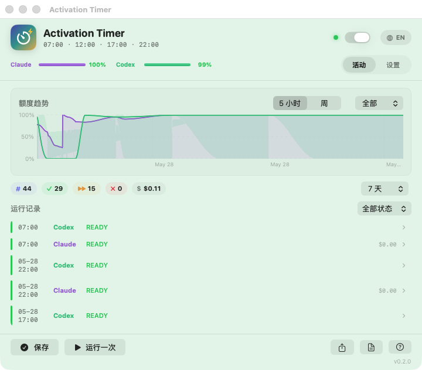
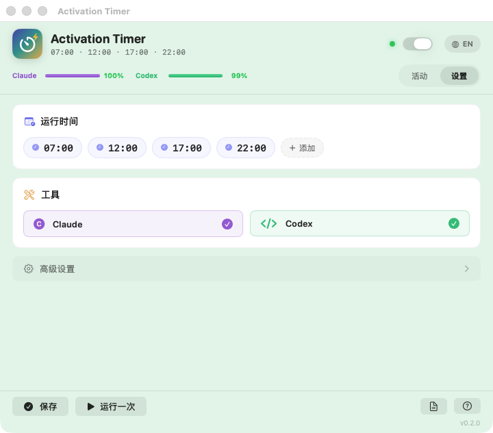

[English](README.md) | [中文](README_CN.md)

# Activation Timer

> 一个很小的 macOS 定时器：按固定时间轻量触发 Claude Code 和 Codex，并记录触发日志、单次 usage、5 小时窗口和周额度状态。

[](https://github.com/hakupao/activation-timer/actions/workflows/ci.yml)
[](LICENSE)

## 项目简介

Activation Timer 适合想把 Claude Code / Codex 用量窗口固定到自己作息时间的人。它通过 macOS `launchd` 定时运行，在一个专用轻量目录里让两个 CLI 只回复 `READY`，并明确要求不要扫描真实项目、不要运行工具、不要修改文件。

默认触发时间是本机时间 `07:00`、`12:00`、`17:00`、`22:00`。

<p align="center">
  
</p>

## 功能

- 使用 macOS `launchd` 定时触发 Claude Code 和 Codex。
- 默认 prompt 极短，并要求不读文件、不运行工具、不修改内容。
- `logs/activation.log` 记录人类可读的运行历史。
- `logs/usage.jsonl` 记录每次真实触发返回的 token/usage 信息。
- `logs/status.jsonl` 记录 5 小时窗口和周额度快照。
- 真实触发前先检查额度；如果明确额度耗尽，会优雅跳过并记录日志。
- 通过 `.env` 配置时间、label、prompt、timeout 和工具路径。
- 支持 dry-run、依赖检查、只查额度、手动触发和卸载。

## 环境要求

- macOS 和 `launchctl`。
- Bash。
- 已登录的 Claude Code CLI。
- 已登录的 Codex CLI。
- `jq`：用于解析 JSONL 日志。
- Node.js：用于查询 Codex quota status。
- `omc` / oh-my-claudecode：用于查询 Claude quota status。

实际定时触发只依赖 Claude 和 Codex CLI；如果缺少 `omc`、`node` 或 `jq`，脚本会记录 warning 并跳过对应的结构化状态记录。

## 快速开始

先选择一种发布包：

- **CLI/launchd 包**：给 IT 高手和想保持极轻量的人，直接用 shell 控制。
- **菜单栏 App 包**：给小白初学者，用图形化界面监看和设置；底层仍然是同一套本地定时器。

### CLI / launchd

```sh
git clone https://github.com/hakupao/activation-timer.git
cd activation-timer
cp .env.example .env
./install.sh check
./install.sh dry-run
./install.sh
```

`./install.sh` 默认执行 `install`，会生成 LaunchAgent 并加载到当前 macOS 用户的 GUI session。

### 菜单栏 App

下载 GUI DMG，把 `Activation Timer.app` 拖到 `Applications` 后打开，然后在
状态栏菜单里安装/重载 schedule、刷新 quota、手动触发、暂停定时器和编辑设置。
App 内置同一套 CLI engine，并会把工作副本放到
`~/Library/Application Support/Activation Timer/activation-timer`。

完整的新手和高手安装步骤见 [INSTALL_CN.md](INSTALL_CN.md)。

## 常用命令

```sh
./install.sh check        # 检查本机依赖
./install.sh dry-run      # 只展示命令，不发送模型 prompt
./install.sh quota        # 只查询额度状态，不发送模型 prompt
./install.sh app-status   # 输出菜单栏 App 使用的 JSON 状态
./install.sh status       # 查看 launchd 状态
./install.sh run-now      # 手动真实触发一次，会发送模型 prompt
./install.sh uninstall    # 卸载 LaunchAgent
./install.sh print-plist  # 打印生成的 launchd plist
```

也可以直接调用 runner：

```sh
./bin/activate-ai-window.sh --once
./bin/activate-ai-window.sh --status
./bin/activate-ai-window.sh --once --tool claude
./bin/activate-ai-window.sh --once --tool codex
```

## 日常运行检查

用下面几条命令判断定时器是否已经安装、是否正在等待触发、以及上次运行结果：

```sh
./install.sh status
tail -f logs/activation.log
tail -n 20 logs/usage.jsonl | jq
tail -n 20 logs/status.jsonl | jq
```

`./install.sh status` 应该能看到已加载的 LaunchAgent，以及你配置的日历触发时间。两次触发之间显示 `state = not running` 是正常的，它表示任务已经加载，正在等待下一个定时点。真正触发的短时间内才可能显示 `running`。

`logs/activation.log` 是最适合日常看的文本日志。一次正常运行大致会像这样：

```text
Activation run started ...
Quota preflight started
Claude job started
Codex job started
Activation run finished exit=0
```

如果 quota preflight 判断额度已经耗尽，就不会发送 prompt，而是干净地记录跳过：

```text
claude job skipped by quota preflight reason=quota_exhausted
codex job skipped by quota preflight reason=quota_exhausted
```

`logs/usage.jsonl` 是结构化的成功/跳过记录。成功触发通常会包含 `ok: true`、`result: READY` 和 `exit_code: 0`。被跳过的触发会包含 `skipped: true` 和 `skip_reason`。

常用命令含义：

- `./install.sh status`：检查本地 `launchd` 是否已经加载定时器。
- `./install.sh quota`：只查额度状态，不发送 prompt。
- `./install.sh dry-run`：只打印计划执行的命令，不发送 prompt。
- `./install.sh run-now`：立刻触发已安装的 LaunchAgent；如果额度可用，可能消耗 usage。

## 配置

复制 `.env.example` 为 `.env`，按需修改：

| 变量 | 说明 | 默认值 |
| --- | --- | --- |
| `LABEL` | macOS LaunchAgent label | `com.activation-timer.ai-window` |
| `SCHEDULE_TIMES` | 逗号分隔的 `HH:MM` 触发时间，每个时间点相互独立 | `"07:00,12:00,17:00,22:00"` |
| `ACTIVATION_TOOL` | `all`、`claude` 或 `codex` | `all` |
| `ACTIVATION_PROMPT` | 发送给 CLI 的低消耗 prompt | `Reply exactly READY...` |
| `TIMEOUT_SECONDS` | 每个工具的超时时间 | `120` |
| `ENABLE_STATUS_SNAPSHOTS` | 真实触发后是否记录额度快照 | `1` |
| `ENABLE_QUOTA_PREFLIGHT` | 发送 prompt 前是否先检查额度 | `1` |
| `QUOTA_PREFLIGHT_ON_UNKNOWN` | 无法确认额度时 `allow` 继续或 `skip` 跳过 | `allow` |
| `QUOTA_EXHAUSTED_THRESHOLD_PERCENT` | 剩余额度低于或等于该百分比时跳过 | `0` |
| `KEEP_AWAKE_MODE` | `off`、`during` 或 `always`；非 `off` 时真实定时触发会用 `caffeinate` 防止睡眠 | `off` |
| `KEEP_AWAKE_SECONDS` | 每次真实触发的防睡眠时长上限 | `900` |
| `CLAUDE_BIN` | Claude 路径覆盖 | 自动发现 |
| `CODEX_BIN` | Codex 路径覆盖 | 自动发现 |
| `JQ_BIN` | `jq` 路径覆盖 | 自动发现 |
| `NODE_BIN` | Node.js 路径覆盖 | 自动发现 |
| `OMC_BIN` | `omc` 路径覆盖 | 自动发现 |
| `PATH_VALUE` | launchd 和 runner 使用的 PATH | Homebrew/local/system 默认路径 |

修改时间或 label 后，重新安装一次：

```sh
./install.sh install
```

## 日志

```sh
tail -f logs/activation.log
tail -20 logs/usage.jsonl | jq
tail -20 logs/status.jsonl | jq
```

日志文件说明：

- `logs/activation.log`：人类可读的运行历史。
- `logs/usage.jsonl`：每个工具每次真实触发的 usage 快照。
- `logs/status.jsonl`：5 小时窗口和周额度快照。
- `logs/raw/`：Claude、Codex 和 status 查询的原始输出。
- `logs/launchd.out.log` / `logs/launchd.err.log`：launchd 的 stdout/stderr。

## 菜单栏 App

CLI/launchd 仍然是主引擎；菜单栏 App 是单独给初学者使用的 GUI 发布形态，
提供 macOS 状态栏控制面板，并共用同一份配置、schedule、quota 快照和日志。

亮点：

- **活动仪表盘** —— 按工具的额度趋势图（5 小时 / 每周）、可展开查看单次详情（token、费用、耗时、session）的运行记录时间线，以及带「时间范围 / 状态 / 工具」筛选的统计条。
- **设置** —— 编辑相互独立的多个触发时间、开关 Claude/Codex、配置高级选项（额度预检、运行后快照、防睡眠、开机自启）。
- **双语界面**，右上角 EN / 中 一键切换；主题随系统明暗自动适配。
- **环境检查**，自动检测必需与可选的命令行工具。
- **运行记录可导出 CSV。**

<p align="center">
  
</p>

本地构建 App：

```sh
./app/ActivationTimerMenuBar/build-app.sh
open "dist/Activation Timer.app"
```

App 不替代脚本，而是调用现有入口：

- `./install.sh app-status`：读取 JSON 状态。
- `./install.sh install`：保存设置后重新加载 LaunchAgent。
- `./install.sh run-now`、`quota`、`dry-run`、`uninstall`：对应菜单操作。

如果在 App 里设置 `KEEP_AWAKE_MODE=always`，菜单栏 App 打开期间会保持
macOS 醒着。即使 App 没开，定时触发仍然照常由 launchd 执行；
`KEEP_AWAKE_MODE=during` 只保护真实触发运行期间。

## 发布打包

维护者可以用一条命令同时生成两种发布包：

```sh
./scripts/package-release.sh
```

`dist/` 下会按人群分开：

- `activation-timer-cli-<version>.tar.gz`：轻量 CLI/launchd 包。
- `activation-timer-gui-<version>.dmg`：给初学者的 GUI App 安装包。
- `activation-timer-gui-<version>.zip`：GUI App 备用压缩包。

## 工作方式

### 架构总览

项目有两个入口——CLI 和菜单栏 App——共享同一套 shell 引擎：

```text
┌──────────────────────────────────────────────────────────┐
│                       入口层                              │
│                                                          │
│   ┌─────────────┐              ┌──────────────────────┐  │
│   │   launchd    │              │  菜单栏 App          │  │
│   │  (定时触发)   │              │  (SwiftUI GUI)       │  │
│   └──────┬──────┘              └──────────┬───────────┘  │
│          │                                │              │
│          │ 按 HH:MM                       │ 通过         │
│          │ 定时启动                        │ Process()    │
│          ▼                                ▼              │
│   ┌─────────────────────────────────────────────────┐    │
│   │             共享 Shell 脚本                       │    │
│   │                                                 │    │
│   │  bin/activate-ai-window.sh  (激活执行器)          │    │
│   │  bin/activation-state.sh    (JSON 状态查询)       │    │
│   │  scripts/install-launchd.sh (launchd 管理器)     │    │
│   └────────────────────┬────────────────────────────┘    │
│                        │                                 │
│                 发送极简 prompt                            │
│                        │                                 │
│              ┌─────────┴─────────┐                       │
│              ▼                   ▼                        │
│        ┌───────────┐      ┌───────────┐                  │
│        │Claude Code│      │  Codex    │                  │
│        │   CLI     │      │   CLI     │                  │
│        └───────────┘      └───────────┘                  │
└──────────────────────────────────────────────────────────┘
```

### CLI 运行流程

当 launchd 到达预定时间（或你手动执行 `./install.sh run-now`）时，激活脚本按以下顺序执行：

1. **加载配置** — 从 `.env` 读取 schedule、工具选择、额度设置和二进制路径。
2. **获取锁** — 创建 `run/activation.lock` 防止并发；如果已有运行中的触发，第二次触发会被优雅跳过。
3. **额度预检**（可选） — 在发送任何 prompt *之前*查询 Claude 和 Codex 的额度状态。如果某个工具的额度已耗尽，该工具会被跳过，跳过记录写入 `logs/usage.jsonl`。
4. **发送 prompt** — 对每个启用的 CLI 发送一个极简 prompt（`Reply exactly READY`）。Claude 使用超轻量模式（见[成本优化](#成本优化)）。Codex 使用 `--ephemeral`、`--skip-git-repo-check`、`--sandbox read-only`，以及精简后的配置（见下文）。
5. **记录 usage** — 用 `jq` 解析每个 CLI 的 JSON 输出，把结构化记录追加到 `logs/usage.jsonl`（token 数量、费用、session ID、模型、耗时等）。
6. **触发后快照**（可选） — 激活后再做一次额度快照，追加到 `logs/status.jsonl`。
7. **释放锁** — 删除 lock 目录，下一次定时触发就可以正常执行。

超时保护：每个 CLI 调用都封装在后台进程中，有可配置的超时时间（默认 120 秒）。如果 CLI 挂起，先发 SIGTERM，2 秒后再发 SIGKILL。

### 菜单栏 App

SwiftUI App 是一层很薄的 GUI 壳——它自己不包含调度器或激活逻辑，所有操作都委托给同一套 shell 脚本：

| App 操作 | Shell 调用 |
| --- | --- |
| 读取状态 | `bin/activation-state.sh --json` |
| 开关定时器 | `install.sh install` 或 `install.sh uninstall` |
| 保存设置 | 写入 `.env`，然后 `install.sh install` |
| 手动触发一次 | `install.sh run-now` |

App 通过 Foundation 的 `Process()` 调用脚本，读取 stdout，再用 `JSONDecoder` 解析成 Swift 数据模型。

### 激活在哪个目录运行？

两个 CLI 都在 **activation-timer 项目目录本身**内被调用——永远不会进入你的真实项目。这是一个只包含脚本和日志的轻量目录，CLI 没有东西可以扫描或修改。

| 安装方式 | 工作目录 | 谁创建的 |
| --- | --- | --- |
| CLI（`git clone`） | 你 clone 的仓库，如 `~/activation-timer` | 你手动 clone |
| 菜单栏 App（开发构建） | 同上，复用源码目录 | 同上 |
| 菜单栏 App（.app / DMG） | `~/Library/Application Support/Activation Timer/activation-timer/` | App 首次启动时自动从 bundle 拷贝脚本 |

目录是怎么找到的：

- **Shell 脚本**：`ROOT_DIR` 在运行时从脚本自身位置（`bin/`）向上取父目录。这意味着项目 clone 到任何路径都能正常工作，无需手动改脚本。
- **菜单栏 App**：`ProjectLocator` 从 app bundle 向上遍历，寻找包含 `bin/activate-ai-window.sh` 的目录。对于独立的 `.app`，会把 bundle 内的脚本拷贝到 Application Support 并以该副本作为工作根目录。

安装脚本会为 macOS `launchd` 生成带绝对路径的 plist，放到 `~/Library/LaunchAgents/`。plist 被 git ignore，因为它包含本机路径。

### 项目结构

```text
activation-timer/
├── bin/
│   ├── activate-ai-window.sh   ← 激活执行器
│   └── activation-state.sh     ← 给 App 用的 JSON 状态
├── scripts/
│   └── install-launchd.sh      ← launchd 安装/卸载
├── app/
│   └── ActivationTimerMenuBar/ ← SwiftUI 菜单栏 App
├── launchd/                    ← 生成的 plist（git ignore）
├── logs/                       ← 生成的日志
│   ├── activation.log
│   ├── usage.jsonl
│   ├── status.jsonl
│   └── raw/
├── .env.example
├── install.sh                  ← 用户入口
└── README_CN.md
```

GitHub Actions 只在 push 和 pull request 时校验仓库脚本。真正的定时触发始终运行在执行过 `./install.sh install` 的那台 Mac 本地。

## 成本优化

每次激活只需一次 API 往返——prompt 和响应加起来不到 300 tokens。成本的瓶颈在于 CLI 自动注入的**系统 prompt**（CLAUDE.md、插件、MCP 工具描述、hooks 等），单次可超过 40 000 tokens。

Runner 会把两个 CLI 的上下文压缩到激活所需的最低限度：

### Claude

| 参数 | 作用 |
| --- | --- |
| `--model haiku` | 最便宜的模型（input ~$0.80/M，Opus ~$15/M） |
| `--system-prompt "Reply only: READY"` | 自定义极简系统 prompt |
| `--setting-sources ""` | 跳过加载 CLAUDE.md、hooks、插件指令——消除 ~40K tokens 的注入上下文 |
| `--effort low` | 最低推理力度 |
| `--strict-mcp-config --mcp-config '{"mcpServers":{}}'` | 空 MCP 配置——去掉所有工具描述 |
| `--tools ""` | 禁用所有内置工具 |
| `--disable-slash-commands` | 禁用 skills |

效果：**~170 input tokens，每次激活 ~$0.001**（优化前 ~40K tokens / ~$0.15）。

### Codex

| 参数 | 作用 |
| --- | --- |
| `--ignore-user-config` | 跳过 `~/.codex/config.toml`——去除插件、MCP、developer instructions |
| `--ignore-rules` | 跳过 `.rules` 文件 |
| `-c 'features.memories=false'` | 禁用 memories |
| `-c 'features.multi_agent=false'` | 禁用 multi-agent |
| `-c 'features.goals=false'` | 禁用 goals |
| `-c 'features.codex_hooks=false'` | 禁用 hooks |
| `-c 'features.child_agents_md=false'` | 禁用 AGENTS.md 加载 |
| `-c 'model_reasoning_effort="low"'` | 最低推理力度 |

效果：**~22K input tokens**（优化前 ~32K）。Codex 内部系统 prompt（~22K）是底线，无法再压缩；ChatGPT 账号也无法切换更轻量的模型。

### 月成本估算（每天 4 次激活）

| 工具 | 优化前 | 优化后 |
| --- | --- | --- |
| Claude | ~$18/月 | **~$0.16/月** |
| Codex | 按配额计算，~32K tokens/次 | 按配额计算，**~22K tokens/次（−31%）** |

## 安全说明

- `dry-run` 不会发送模型 prompt。
- `quota` 只查询账号/rate-limit 状态和本地 cache，不会发送模型 prompt。
- `run-now` 和定时触发会先做 quota preflight；只有额度看起来可用时，才给启用的工具发送一个很短的 prompt。
- 如果明确额度已经耗尽，对应工具会被跳过，并在 `logs/usage.jsonl` 里记录 `skipped: true`。
- Claude 使用 `--model haiku`、`--setting-sources ""`、`--system-prompt`、`--effort low`、`--strict-mcp-config` 空配置、无 tools、无 slash commands、无 session persistence。详见[成本优化](#成本优化)。
- Codex 使用 `--ephemeral`、`--skip-git-repo-check`、`--sandbox read-only`、`--ignore-user-config`、`--ignore-rules`，并禁用 memories、multi-agent、goals、hooks 等功能。
- 生成的 plist 会被 git 忽略，因为它包含本机绝对路径。

## 卸载

```sh
./install.sh uninstall
```

如果你从旧 label 迁移，可以安装时设置 `LEGACY_LABELS="old.label"`，这样旧 LaunchAgent 会被清理，避免重复触发。

## 参与贡献

提交修改前建议先运行：

```sh
./scripts/validate.sh
```

更多说明见 [CONTRIBUTING.md](CONTRIBUTING.md)。

## 更新记录

版本变化见 [CHANGELOG.md](CHANGELOG.md)。

## License

本项目使用 MIT License。详情见 [LICENSE](LICENSE)。
